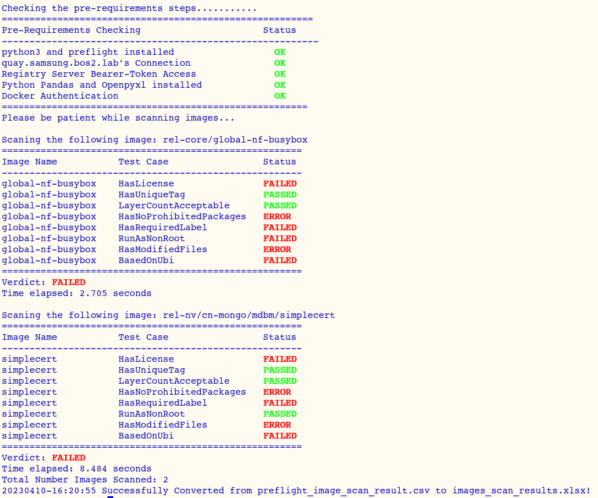
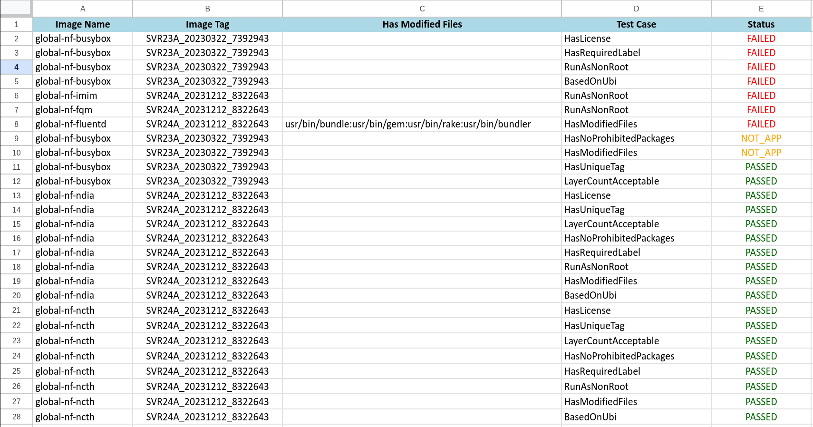
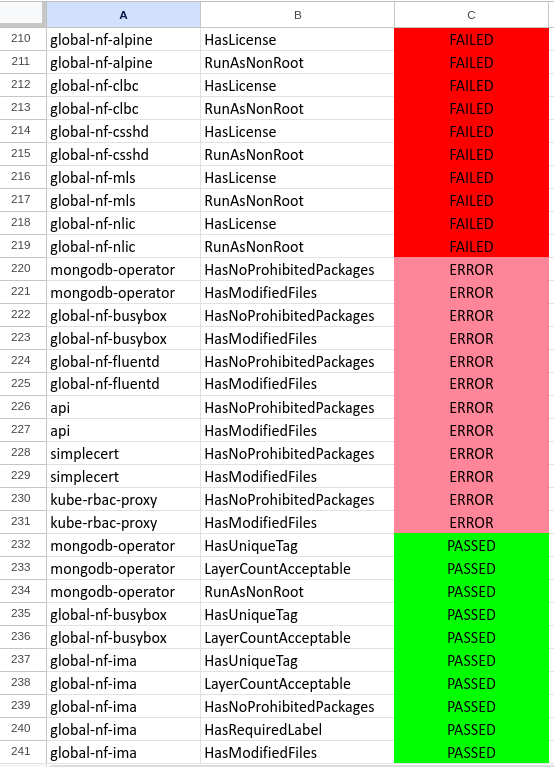

# quick_scan_container_images_online_offline
This script is designed to streamline the Preflight scanning process for container images, whether Quay RESTAPI is utilized or not. Preflight scanning serves the purpose of assessing whether container images adhere to security best practices, specifically regarding CVE tests, without the need for submission to the Backend Catalog.

With the latest Preflight releases, the scanning capability has been enhanced to detect changes or removals of original UBI-based image files within multiple layers of Docker images. This scanning process serves as a preliminary check before submission to the backend, ensuring that all criteria are met.

The script produces test case results, which are initially displayed in the console and then exported to both CSV and XLS formats using a Python script.

## Pre-Requisites
- Clone this github repo then use the scripts  
- Login to Private Registry Server with  
  `podman login -u xxx quay.io`
- To access to Quay.io Or Private Registry via REST API, it requires oauth and bear token
- Push images to Quay Repository with specific Organization
- Python3 + Pandas and Openpyxl using `pip3 install pandas openpyxl`   
  if `pip3` is not installed yet then `sudo dnf install python3-pip -y`
- netcat (nc) rpm installed if not there it will skip the connectivity checking
- bc rpm is also needed for check time
  sudo dnf install bc -y
- Install preflight 
```shellSession
wget https://github.com/redhat-openshift-ecosystem/openshift-preflight/releases/download/1.12.0/preflight-linux-amd64
chmod +x preflight-linux-amd64
sudo mv preflight-linux-amd64 /usr/local/bin/preflight
```

## Quick Images Scan Shell Script Usage
```shellSession
$ bash quick_scan_container_images_online_offline.sh -h
------------------------------------------------------------------------------------------------------------------------
Usage (API-based):
    quick_scan_container_images_online_offline.sh -rn <repo_ns> -cp <cnf_prefix> [-t <tag_type>] -d <auth.json> -at <api_token> -fq <fqdn> [-ft <filter>]
    
      -rn | --repo-ns
            The repository namespace: either an organization or a user name 
            (e.g., "avareg_5gc" or "avu0").
      
      -cp | --cnf-prefix
            The CNF image prefix to search for. This can be a specific prefix (e.g., "global-amf-rnic")
            or a wildcard/multiple prefixes separated by a pipe character (e.g., "global|non-global").
      
      -t | --tag-type (Optional)
            The image tag type: "name" to use the image tag, or "digest" to use the manifest digest.
            If omitted, the default is "name".
      
      -d | --auth-json
            The path to the Docker authentication JSON file (e.g., auth.json).
            If container image does not need docker auth, then it's optional.
      
      -at | --api-token
            The API token (Bearer Token) generated by the Registry Server Admin.
      
      -fq | --fqdn
            The fully-qualified domain name of your private registry (e.g., quay.io).
      
      -ft | --filter (Optional)
            A filter to exclude certain images. For example, use "existed_image|tested_image"
            to filter out images containing these strings.

Usage (Offline):
    quick_scan_container_images_online_offline.sh --img <image_list.txt> -d <auth.json> -fq <fqdn>

      --img | --img-file
            A text file containing a list of images to scan (one image per line).
      
      The other options are the same as described above.

Additional Examples:
    Example 1 (API-based):
      quick_scan_container_images_online_offline.sh -rn ava -cp "global-|specific" -d auth.json -at xxxxxx -fq quay.io -t name -ft "existed_image|tested_image"
      
    Example 2 (API-based with defaults):
      quick_scan_container_images_online_offline.sh -rn avareg_5gc -cp global- -d auth.json -at xxxxxx -fq quay.io
      
    Example 3 (Offline):
      Private-Registry:
      quick_scan_container_images_online_offline.sh --img image_list.txt -d auth.json -fq quay.io
      
      Public-Registry:
      quick_scan_container_images_online_offline.sh --img image_list.txt -fq quay.io

Note:
    - Both "tag-type" and "log-type" (if used) are optional.
    - Ensure that all required files (like the authentication JSON) exist and are accessible.
------------------------------------------------------------------------------------------------------------------------
```
## Start Container Images Using Preflight
```shellSession
$ bash quick_scan_container_images_online_offline.sh -rn xxxxxxx_5gc -cp "busybox|simple"

Checking the pre-requirements steps...........
========================================================
Pre-Requirements Checking                      Status    
---------------------------------------------------------
python3 and preflight installed                  OK                      
quay.xxxxxxx.bos2.lab's Connection               OK                      
Registry Server Bearer-Token Access              OK                      
Python Pandas and Openpyxl installed             OK                      
Docker Authentication                            OK                      
=======================================================

Please be patient while scanning images...

Scaning the following image: rel-test/univ-box
======================================================
Image Name           Test Case                 Status    
------------------------------------------------------
univ-box    HasLicense                FAILED    
univ-box    HasUniqueTag              PASSED    
univ-box    LayerCountAcceptable      PASSED    
univ-box    HasNoProhibitedPackages   ERROR     
univ-box    HasRequiredLabel          FAILED    
univ-box    RunAsNonRoot              FAILED    
univ-box    HasModifiedFiles          ERROR     
univ-box    BasedOnUbi                FAILED    
======================================================
Verdict: FAILED    
Time elapsed: 2.533 seconds

Scaning the following image: rel-test/mongo/mdbm/notsimple
======================================================
Image Name           Test Case                 Status    
------------------------------------------------------
notsimple           HasLicense                FAILED    
notsimple           HasUniqueTag              PASSED    
notsimple           LayerCountAcceptable      PASSED    
notsimple           HasNoProhibitedPackages   ERROR     
notsimple           HasRequiredLabel          FAILED    
notsimple           RunAsNonRoot              PASSED    
notsimple           HasModifiedFiles          ERROR     
notsimple           BasedOnUbi                FAILED    
======================================================
Verdict: FAILED    
Time elapsed: 6.189 seconds
Total Number Images Scanned: 2
20230410-15:54:30 Successfully Converted from preflight_image_scan_result.csv to images_scan_results.xlsx!
```

- **Images Scan Console Output:** 
<!--  -->

- **New Images Scan with Debug**
<!--  -->

- **Images Scan XSLX Output:**   
<!--  -->

## Start Container Images Preflight Scan Automation Without Quay RESTAPI
When Partner do not have the priviledge to access Quay or private registry RESTAPI, if you are on disconnected environment, you can prepare a list container images with URL to any filename e.g. image_list.txt.
If images private, then provide auth.json otherwise you can exclude from argument. 
**image_list.txt:**
```shellSession
quay.ava.lab/ava_5gc/ava-core/univ-smf-nec:v1
quay.ava.lab/ava_5gc/ava-core/univ-smf-nad:v1
quay.ava.lab/ava_5gc/ava-core/univ-nrf-att:v1
```
- How to run this script without Quay/Registry API (Offline)  
```shellSession
With Auth.json:
$ bash quick_scan_container_images_online_offline.sh bash -img image-test.txt -fq quay.io -d ./auth.json

Without Docker Authentication:
$ bash quick_scan_container_images_online_offline.sh bash -img image-test.txt -fq quay.io
```

- Output for offline
```shellSession
API_TOKEN is not defined then you are using image-test.txt file!!

Checking the pre-requirements steps...........
========================================================
Pre-Requirements Checking                      Status    
---------------------------------------------------------
python3 and preflight installed                  OK                      
bc utility installed                             OK                      
Check Preflight Minimum version 1.6.11+          OK                      
quay.io's Connection                             OK                      
Python Pandas and Openpyxl installed             OK                      
=======================================================
quay.io/avu0/yings-nginx-oneshot1-8081:1-24
quay.io/avu0/ying-nginx-oneshot1-8081:1-24
Please be patient while scanning images...

Scanning the following image: avu0/yings-nginx-oneshot1-8081:1-24
================================================================================
20250225-19:31:29 Preflight scan failed for image: quay.io/avu0/yings-nginx-oneshot1-8081:1-24

Scanning the following image: avu0/ying-nginx-oneshot1-8081:1-24
================================================================================
Image Name                 Test Case                  Status    
-------------------------------------------------------------
ying-nginx-oneshot1-8081 HasLicense                   PASSED        
ying-nginx-oneshot1-8081 HasUniqueTag                 PASSED        
ying-nginx-oneshot1-8081 LayerCountAcceptable         PASSED        
ying-nginx-oneshot1-8081 HasNoProhibitedPackages      PASSED        
ying-nginx-oneshot1-8081 HasRequiredLabel             PASSED        
ying-nginx-oneshot1-8081 RunAsNonRoot                 PASSED        
ying-nginx-oneshot1-8081 HasModifiedFiles             PASSED        
ying-nginx-oneshot1-8081 BasedOnUbi                   PASSED        
ying-nginx-oneshot1-8081 HasProhibitedContainerName   PASSED        
Verdict: PASSED    
Time elapsed: 29.953 seconds
--------------------------------------------------------------
Total Number Images Scanned: 1
Total Time Scanned: 00h:00m:29s
------------------------------------------------------
20250225-19:31:59 Container images scan failed; skipping CSV conversion.
```
- convert csv to xlsx manually if some images are failed to scan
```shellSession
$ python3 csv_to_xlsx_converter.py 
usage: csv_to_xlsx_converter.py [-h] input_file output_file
python3 csv_to_xlsx_converter.py input.csv output.xslx
```
